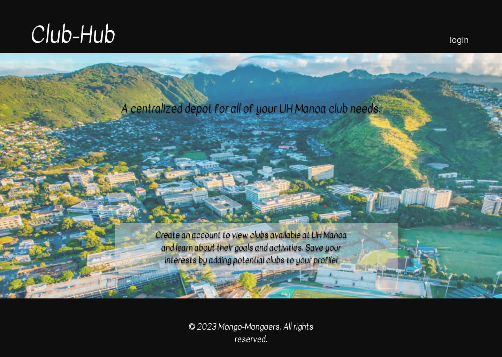
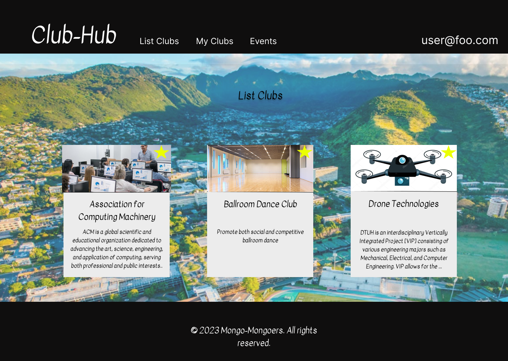
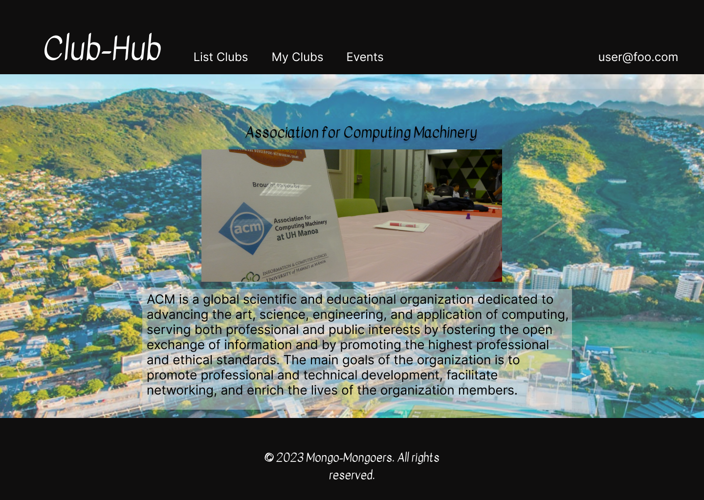
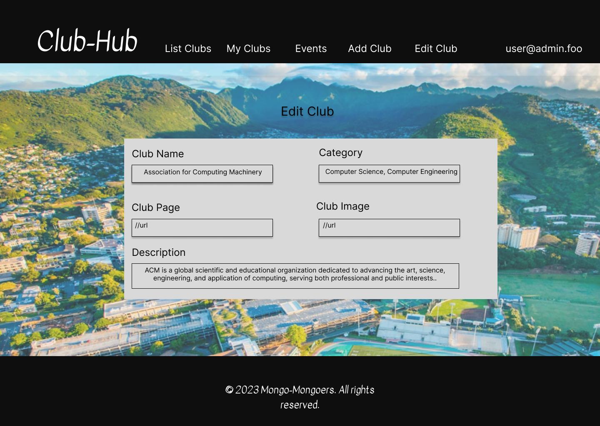
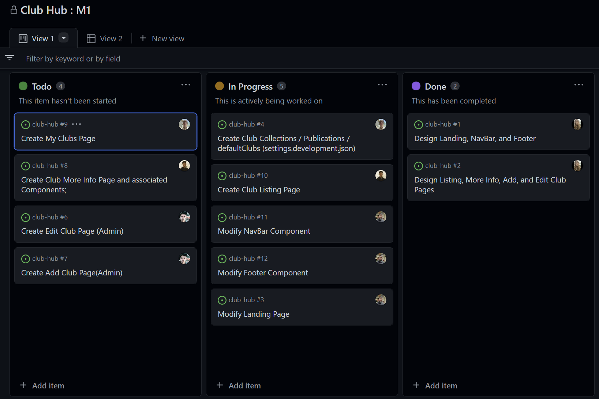
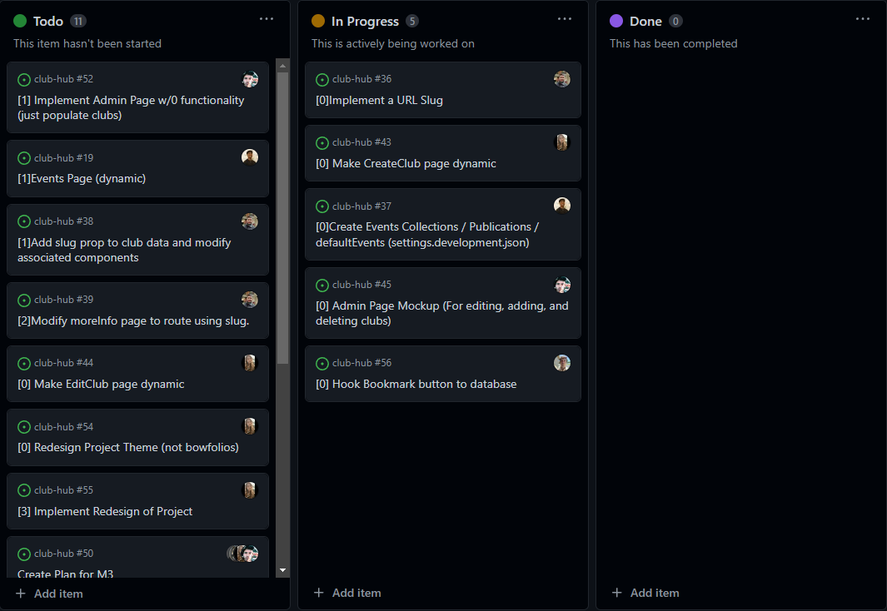
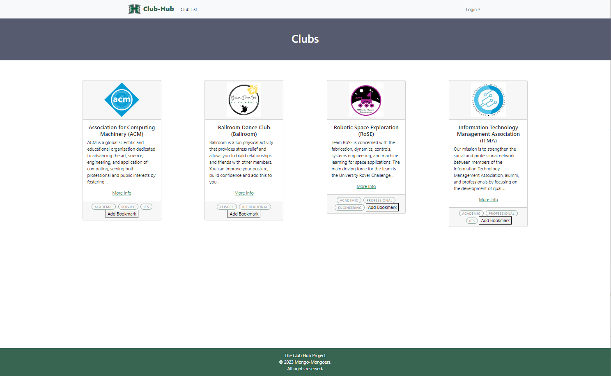
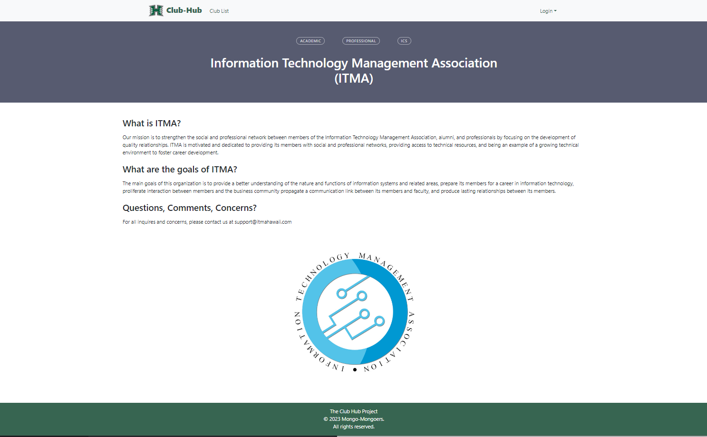
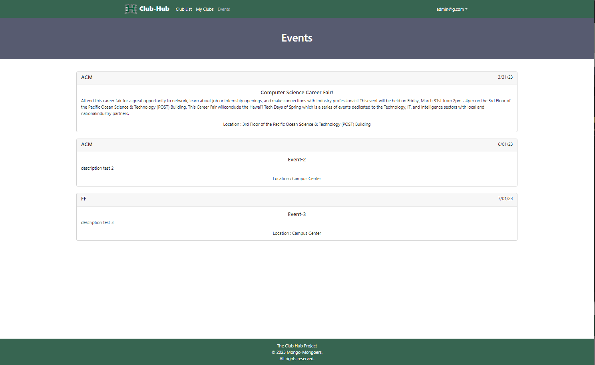

# Club Hub

## Table of contents
* [Overview](#overview)
* [Deployment](#deployment)
* [About Us](#about-us)
  * [GitHub Organization Page](#github-organization-page)
  * [Team Contract](#team-contract)
* [Goals](#goals)
* [Community Feedback](#community-feedback)
* [Finished Product](#finished-product)
* [Mockup Page Drafts](#mockup-page-drafts)
* [State Of Project](#state-of-project)
* [Development History](#development-history)
* [Contact Us](#contact-us)

## Overview
This assignment will allow students to view and bookmark clubs at the university, and officers to make changes to their clubs and create events.

**Part 1: Student View**

Students will be able to:

* View all clubs
* Filter clubs by category
* Bookmark favorite clubs
* View club information
* View a list of club events

**Part 2: Officer View**

Officers will be able to:

* Update club information
* Create events

The assignment will be completed using Meteor, Node.js, MongoDB, and React.

The assignment will be graded on functionality, usability, design, and code quality.

## Deployment 

This is a link to the live site: [Club Hub (live-site)](http://46.101.72.186)

## About Us
### [GitHub Organization Page](https://github.com/mongo-mongoers)
### [Team Contract](https://docs.google.com/document/d/1XqRXCuDjJ23BOATImhVEAbj1vgFtvK94FJQX5W9s3eI/edit?usp=sharing)

*Maxwell Pauly, Cash Baker, Liliana Royer, Luu Danny, Patrick Manuel*

Our project represents an opportunity for us to apply the theoretical concepts we have learned in class to real-world problems. We are committed to producing a high-quality product that not only meets our professor's requirements but also demonstrates our passion for computer science. We are a group of passionate computer science students working together on a class project. Our team is comprised of individuals with diverse backgrounds, skill sets, and interests, but we all share a common goal: to develop an innovative solution that will make a difference in the UH community.

## Goals
The primary objective of Club Hub is to streamline the management of clubs and organizations within a university or college. Our software engineering team aims to develop a centralized platform that will enable students to connect with each other, join or create clubs, and manage all the relevant activities with ease. With Club Hub, we aim to empower the students to take charge of their extracurricular activities and enhance their overall college experience.

## Community Feedback

* The site is easy to use and navigate.
* The information is well-organized and easy to find.
* The site is visually appealing.
* The site is responsive and works well on mobile devices.

Some suggestions for improvement include:

* Adding more features, such as the ability to create and manage events.
* Adding more clubs to the database.
* Improving the search functionality.

Overall, the site is a valuable resource for students and club officers.

## Finished Product
Club Hub is a comprehensive platform designed to meet the unique needs of students in managing clubs and organizations. With a user-friendly interface, students can easily create or join clubs, organize events, communicate with club members, and manage club finances. The platform is scalable and customizable, enabling each club to tailor its page to meet its specific needs. The finished product is a web application that is easily accessible from any device, making it convenient for students to manage their club activities on the go.

## Mockup Page Drafts

#### Landing Page

The main page of the club website that serves as an introduction and entry point for users.

#### List Clubs Page

A page that displays a list of all the clubs available on the website.

#### Club Page (individual)

A page that displays detailed information about a particular club, including its description, events, and members.

#### My Clubs Page

A page that displays the clubs that the current user is a member of.

#### Add Club Page

A page that allows users to add a new club to the website.

#### Edit Club Page

A page that allows users to edit the details of an existing club on the website.

## State Of Project
Our team of software engineering students has been working diligently on the development of Club Hub. We are currently in the beta testing phase, and we are actively seeking feedback from users to make improvements to the platform. We have successfully implemented the core features of the application, including club creation, event management, and communication tools. We are continuously working to enhance the user experience and to add new features to make Club Hub the ultimate platform for managing clubs and organizations. Stay tuned for updates as we continue to refine and improve the application.

## Development History

## Milestone 1

[Milestone 1](https://github.com/orgs/mongo-mongoers/projects/1)

The goal of Milestone 1 was to create a set of HTML pages providing a mockup of the pages in the system.

[Milestone 2](https://github.com/orgs/mongo-mongoers/projects/2)

The goal of Milestone 2 was to implement dynamic functionalities to the mockup pages by routing them to the database.

## Milestone 1 Pages

#### Club List Page

#### Club Info Page

#### Events Page

#### Bookmark Page

#### Login Page

#### Signup Page

#### Create Club Page

#### Edit Club Page

## Contact Us

This website was developed by Maxwell Pauly, Cash Baker, Liliana Royer, Luu Danny, and Patrick Manuel. You can contact us at our GitHub organization: https://github.com/mongo-mongoers or email us at clubhub@notarealemail.com.

